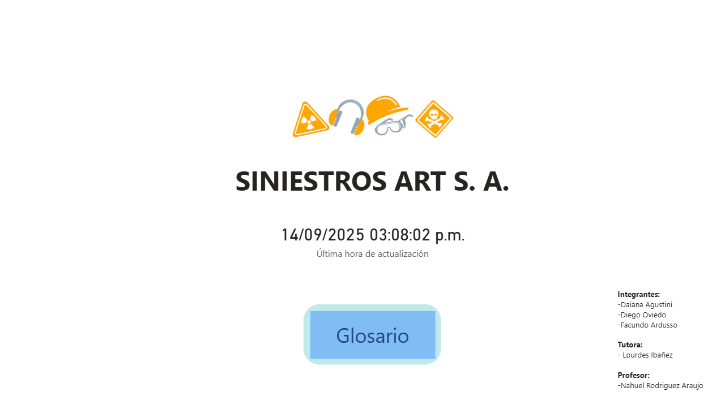
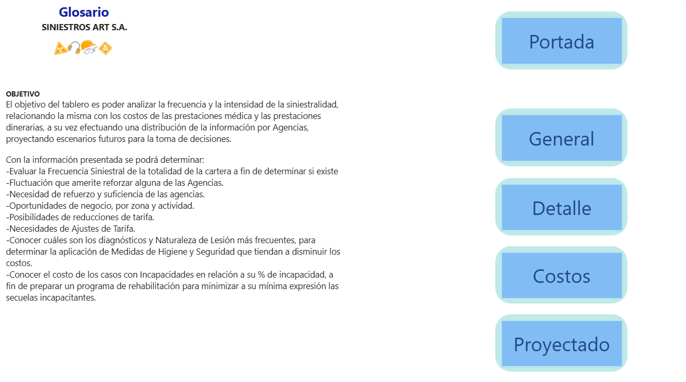
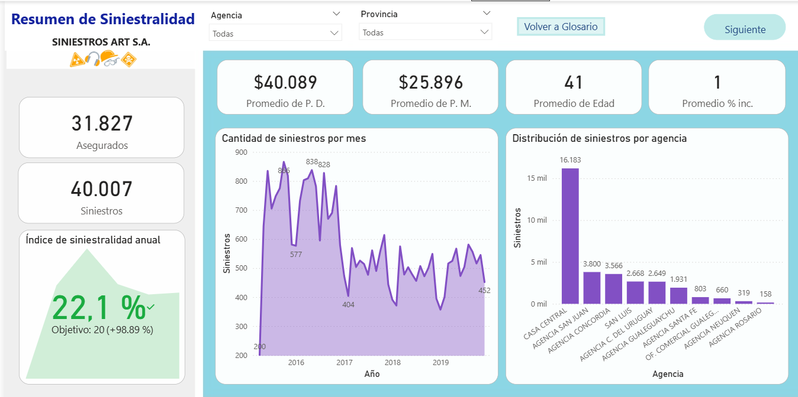
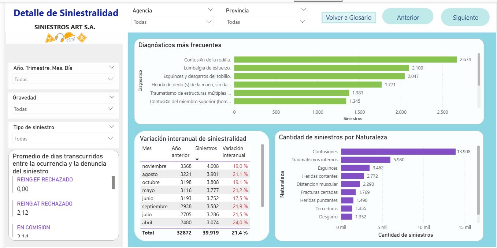
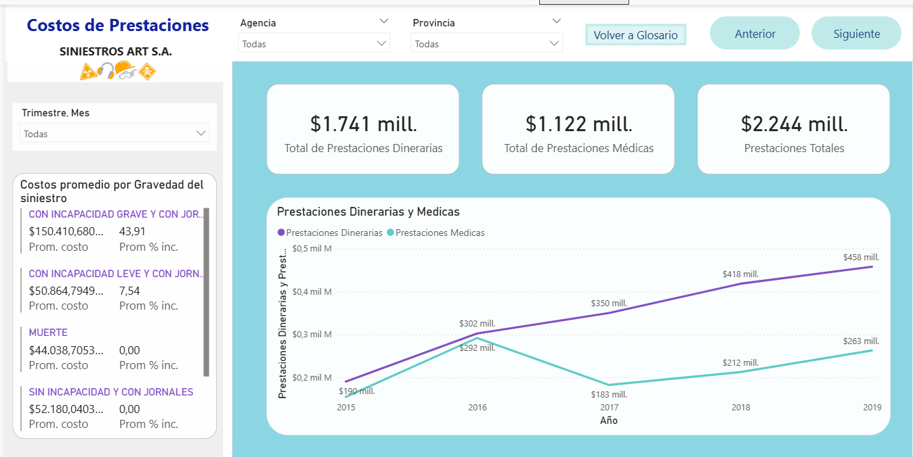
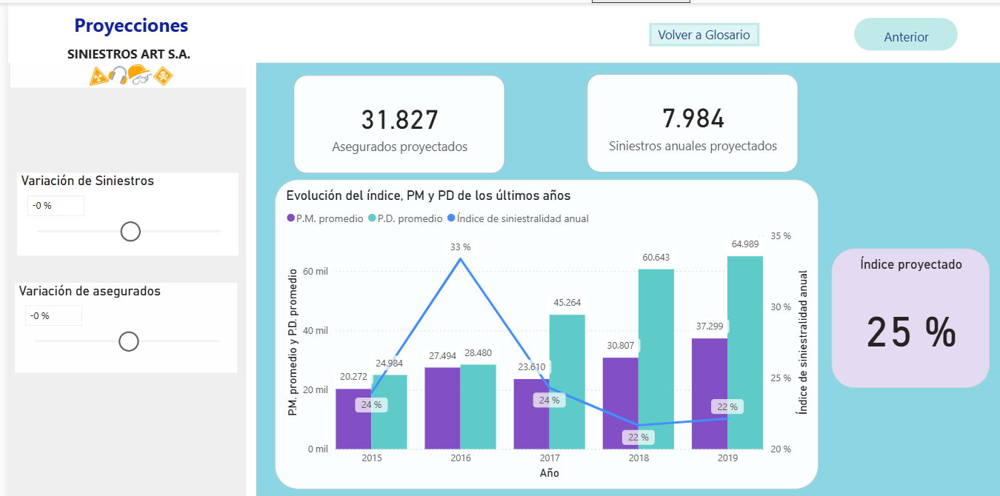

# Informe Final del curso de PowerBI en CoderHouse - 2021

## OBJETIVO
El objetivo del tablero es poder analizar la frecuencia y la intensidad de la siniestralidad, relacionando la misma con los costos de las prestaciones médica y las prestaciones dinerarias, a su vez efectuando una distribución de la información por Agencias, proyectando escenarios futuros para la toma de decisiones.

Con la información presentada se podrá determinar:
-Frecuencia Siniestral de la totalidad de la cartera a fin de determinar si existe
-Fluctuación que amerite reforzar alguna de las Agencias.
-Necesidad de refuerzo y suficiencia de las agencias.
-Oportunidades de negocio, por zona y actividad.
-Posibilidades de reducciones de tarifa.
-Necesidades de Ajustes de Tarifa.
-Conocer cuáles son los diagnósticos y Naturaleza de Lesión más frecuentes, para determinar la aplicación de Medidas de Higiene y Seguridad que tiendan a disminuir los costos.
-Conocer el costo de los casos con Incapacidades en relación a su % de incapacidad, a fin de preparar un programa de rehabilitación para minimizar a su mínima expresión las secuelas incapacitantes.

### Portada

### Glosario
Se presenta el objetivo del dashboard y los diferentes análisis que permite. Así como también el acceso a las diferentes solapas.

### General
Se muestra información general respecto a cantidad de asegurados y siniestros totales de la compañía y el indicador más importante (Indice de siniestralidad anual) que define la rentabilidad del negocio. Se presenta la evolución de siniestros mes a mes y la distribución de los mismos por agencia. Así como también el promedio del % de incapacidad y de edad de los accidentados y los costos promedios en relación con Prestaciones Dinerarias y Medicas.

### Detalle
Se presentan dos gráficos con TOP 10 de Naturaleza y Diagnósticos más frecuentes. Se muestra el promedio en la demora de denuncia de los accidentes y su clasificación según la gravedad. A modo de tabla se presenta una comparativa de la siniestralidad anual, dado que el volumen de siniestros sigue un patrón anual, se resume la variación en la cantidad de accidentes para un mes respecto del mismo mes del año anterior.

### Costos
Detalle de la evolución de las prestaciones dinerarias, médicas y totales. Así como también los costos promedio y el % de incapacidad en relación con la gravedad de los siniestros.

### Proyectado
Se presenta un gráfico central con la evolución de los últimos años de las prestaciones dinerarias y médicas promedio y el índice de siniestralidad anual. A su vez, se permite el cálculo del índice induciendo variaciones en la cantidad de asegurados y en la cantidad de siniestros, partiendo de los valores actuales de la cantidad de asegurados y en el promedio anual de cantidad de siniestros.

