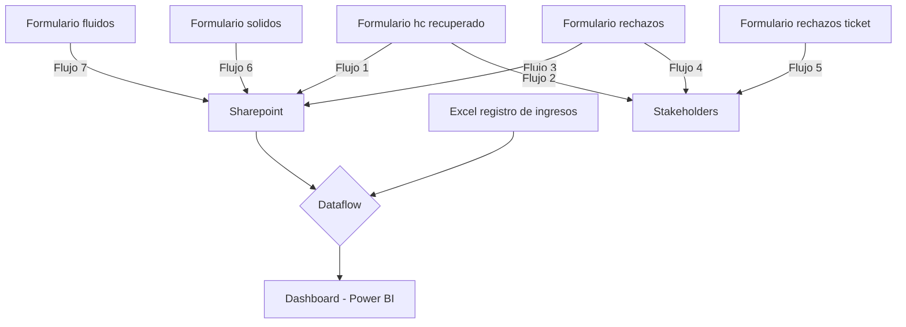
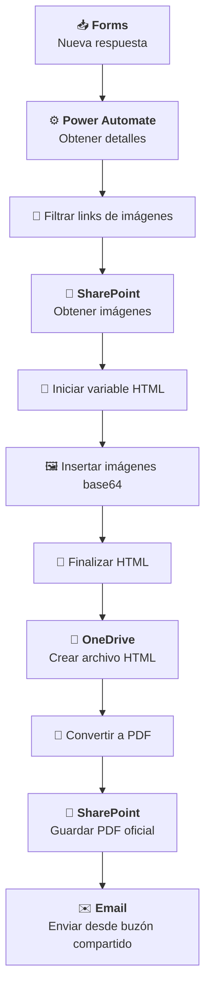

# Integración de reportes de laboratorio (Power Automate)

## Descripción del proyecto

**Problema:**
El laboratorio de la planta necesitaba optimizar la generación y distribución de reportes de análisis, que se realizaban de forma manual, generando demoras, errores y falta de trazabilidad en la información compartida entre áreas.

**Rol y aporte personal:**
Diseñé y desarrollé flujos automatizados en Power Automate que integran Microsoft Forms, SharePoint, OneDrive y correo corporativo, para estandarizar la creación de reportes, convertirlos automáticamente a PDF y distribuirlos a los responsables. Además, desarrollé un flujo de datos para procesos ETL y un tablero en Power BI para el seguimiento del laboratorio.

**Impacto logrado:**
La automatización permitió reducir un 40 % el tiempo de generación y envío de reportes, mejorar la trazabilidad y control documental, y asegurar la disponibilidad inmediata de la información para todas las áreas operativas y de gestión. 

## Desarrollo

**Integración de reportes de laboratorio**

Mediante una sencilla página web de sharepoint se centralizó la disponibilidad de todos los enlaces relevantes, mejorando el acceso y la navegación.

Los links superiores de la web de laboratorio corresponden a formularios que desencadenan distintos flujos automatizados:

1. Reportar un análisis de hidrocarburo recuperado
2. Reportar un rechazo (con análisis de laboratorio)
3. Reportar un rechazo (sin análisis de laboratorio)
4. Análisis de sólidos
5. Análisis de fluidos

Los 2 primeros reportes contienen 2 flujos automatizados cada uno, uno para la
generación, conversión, almacenamiento y distribución de reportes y uno
adicional que colecta la información en una única lista de sharepoint. El formulario 3 solo contiene un flujo que notifica a los stakeholders y en el
caso de los formularios de Analisis de sólido y fluidos, solo se colectan los datos ya que no requiere notificación.

### Flujo de trabajo

Los flujos 2, 4 y 5 se ocupan de la generación, conversión, almacenamiento y distribución de reportes. El flujo 5 está simplificado porque recolecta menos información que los numero 2 y 4.
Los flujos 1, 3, 6, y 7 solamente se ocupan de recolectar los registros en una lista de sharepoint.
La decisión de utilizar utilizar varios formularios es con el objetivo de hacerlos específicos a la información a cargar y que la misma sea obligatoria, para forzar la completitud de los datos y agilizar la carga.

**Nombre del flujo: Reporte de rechazo de unidad**

Este flujo representa la estructura de los flujos 2, 4 y 5 y su función es automatizar la generación, conversión, almacenamiento y distribución de reportes
de rechazo de unidades en el laboratorio de la planta de tratamiento y recuperación de residuos oleosos. A continuación se detalla su funcionamiento completo:

**🔹 Disparador**

- Se activa al recibir una nueva respuesta en el formulario TRON de Microsoft Forms.

**🔹 Extracción de datos**

- Recupera todos los campos relevantes de la respuesta, incluyendo:
    - Ticket
    - Fecha y hora
    - Manifiesto
    - Reporte
    - Motivo de rechazo
    - Transportista
    - Equipo
    - Unidad
    - Origen
    - Resultados del análisis (densidad, % aceite, % agua, % sólidos)
    - Volumen rechazado

**🔹 Procesamiento de imágenes**

- Extrae una lista de links desde un campo del formulario.
- Filtra los que contienen "link" y accede a SharePoint para obtener las imágenes.
- Inserta las imágenes en el HTML como bloques codificados en base64.

**🔹 Generación del documento**

- Construye un documento HTML con formato profesional.
- Incluye encabezado, secciones informativas, resultados, imágenes y pie de página.

**🔹 Conversión y almacenamiento**

- Guarda el HTML en OneDrive.
- Lo convierte a PDF.
- Finalmente, almacena el PDF en una carpeta específica de SharePoint para reportes oficiales.

**🔹 Distribución por correo**

- Envía un correo desde un buzón compartido a una lista de destinatarios internos.
- El correo incluye los datos clave del rechazo y adjunta el reporte PDF generado.

Este flujo garantiza
una trazabilidad completa del rechazo, desde la captura en el formulario hasta
la distribución del reporte, todo de forma automatizada y estandarizada.

## Arquitectura (Mermaid)

## Decisiones técnicas
- HTML→PDF en OneDrive permite crear PDFs sin licencias premium.
- Imágenes base64 para portabilidad.
- SharePoint como repositorio oficial documental (trazabilidad - sistema de gestión de calidad)
- Buzón compartido para ownership del envío y estandarización de e-mails.

### **Paso a paso del flujo**

**1. 🟢 Disparador: "Cuando se envía una respuesta nueva"**

- Se activa cuando se recibe una nueva respuesta en un formulario de Microsoft Forms.
- El formulario está identificado por un ID
- Usa un webhook para escuchar respuestas en tiempo real.

**2. 📥 Acción: "Obtener los detalles de la respuesta"**

- Recupera los datos completos de la respuesta enviada.
- Utiliza el response_id generado por el disparador para acceder a los campos específicos del formulario.

**3. 📝 Acción: "Redactar"**

- Extrae un campo específico de la respuesta.
- Este campo contiene una lista separada por comas. Corresponde a los links de las imágenes que se adjuntan en el formulario.

**4. 🧮 Acción: "Inicializar variable - IdList"**

- Crea una variable tipo array llamada IdList.
- Divide el contenido del campo redactado en elementos individuales usando split(). Para extraer las URLs de las imágenes

**5. 🔍 Acción: "Filtrar matriz"**

- Filtra los elementos del array IdList para quedarse solo con aquellos que contienen la palabra "link". Correspondientes a los enlaces de las imágenes.

**6. 🧪 Acción: "Inicializar variable - fileContent"**

- Crea una variable vacía tipo array llamada fileContent.
- Se usará más adelante para almacenar contenido (imágenes o archivos).

**7. 🧾 Acción: "Inicializar variable - html_doc"**

- Crea una variable tipo string llamada html_doc.
- Contiene una plantilla HTML completa para generar un reporte visual. 
- Incluye estilos CSS para formato A4, encabezados, secciones, contenedores flexibles, y soporte para impresión.

[2024_PowerAutomate_automatizacion_lab/templates/doc_html_informe.html](https://github.com/daianaagustini/Portfolio_PowerBI/blob/main/2024_PowerAutomate_automatizacion_lab/templates/doc_html_informe.html)

**8. 📂 Acción: "Obtener archivos (solo propiedades)"**

- Accede a una carpeta específica en SharePoint para obtener los archivos disponibles.
- Esta carpeta contiene las imágenes cargadas mediante el Forms.

**9. 🔁 Acción: "Aplicar a cada uno"**

- Itera sobre los elementos filtrados previamente (los que contienen "link").
- Dentro del bucle realiza varias acciones:

**a. 🧪 "Redactar_1" y "Redactar_2"**

- Decodifica y limpia la URL del archivo.

**b. 📥 "Obtener contenido de archivo mediante ruta de acceso"**

- Descarga el contenido del archivo desde SharePoint.

**c. 📄 "Obtener metadatos de archivo mediante ruta de acceso"**

- Recupera el nombre y otros metadatos del archivo.

**d. 📦 "Anexar a la variable de matriz"**

- Agrega el contenido del archivo a la variable fileContent.

**e. 🖼️ "Anexar a la variable de cadena 2"**

- Inserta la imagen en el HTML como un bloque  codificado en base64.
- El bucle está creado para recibir y almacenar varios archivos. Sin embargo, se limita el formulario a la carga de 1 solo archivo con un máximo de 1.4Mb.

**10. 🧩 Acción: "Anexar a la variable de cadena 2-copy"**

- Finaliza el documento HTML agregando el cierre de etiquetas y el pie de página.

**11. 🗂️ Acción: "Crear archivo 2"**

- Guarda el documento HTML en OneDrive.
- El nombre del archivo incluye el Manifiesto y la fecha de envío del ormulario de modo que sea un nombre único.

**12. 🔄 Acción: "Convertir un archivo mediante una ruta de acceso"**

- Convierte el archivo HTML en formato PDF usando OneDrive.

**13. 🗃️ Acción: "Crear archivo"**

- Guarda el archivo PDF final en una carpeta específica de SharePoint.
- En esta carpeta se guardan las evidencias e informes realizados por el laboratorio para el control documental y el sistema de gestión de excelencia operacional.

**14. 📧 Acción: "Enviar un correo electrónico desde un buzón compartido (V2)"**

- Envía un correo desde un buzón compartido.
- Destinatarios: múltiples correos de stakeholders (internos, del cliente y terceros), incluyendo áreas como logística, supervisión, jefatura y analistas de ambiente, ingenieros de proceso, gestión de calidad y trazabilidad.
- Asunto: “Rechazo de unidad [Unidad]”, donde la unidad se extrae del formulario.
- Cuerpo del mensaje:
    - Incluye detalles como unidad, pozo, equipo, manifiesto, transportista, motivo de rechazo y volumen rechazado.
    - Firma: “Laboratorio Planta TRON – Servicios ambientales AESA”.
- Adjunta el archivo PDF generado previamente con el reporte.
- El objetivo de este correo electrónico es notificar la unidad rechazada al área de logística para su gestión y otros stakeholders

## Conclusión
La implementación de estos flujos automatizados en Power Automate para la generación y gestión de reportes de laboratorio representó un avance significativo en la eficiencia operativa, trazabilidad y estandarización de procesos dentro del sistema de gestión ambiental de la planta.

La digitalización completa del ciclo —desde la captura de datos en Microsoft Forms hasta la distribución automatizada de reportes en PDF mediante SharePoint y correo corporativo— permitió eliminar tareas manuales repetitivas, reducir errores humanos y garantizar la disponibilidad inmediata de la información para todas las áreas involucradas.

Entre los principales beneficios alcanzados se destacan:

- Reducción del tiempo (en al menos 40%) de confección y distribución de reportes, pasando de procesos manuales a flujos automáticos que operan en segundos.

- Trazabilidad total de cada registro, desde el formulario de entrada hasta el almacenamiento y notificación final. Permitiendo

-  Estandarización y control documental, al centralizar los archivos oficiales en SharePoint con nomenclaturas y ubicaciones consistentes.

-  Mayor calidad y disponibilidad de los datos, facilitando su análisis posterior y la toma de decisiones. Se desarrolló un tablero en Power BI para la evaluación y mejora de la eficiencia y confiabilidad del laboratorio.

-  Integración transparente entre herramientas corporativas disponibles de Microsoft (Forms, SharePoint, OneDrive, Outlook), sin necesidad de desarrollos externos o costos extras.

Estas soluciones no solo mejoran la productividad del laboratorio, sino que sientan las bases para una cultura de automatización y mejora continua, alineada con los principios de excelencia operacional y sostenibilidad tecnológica de la organización.