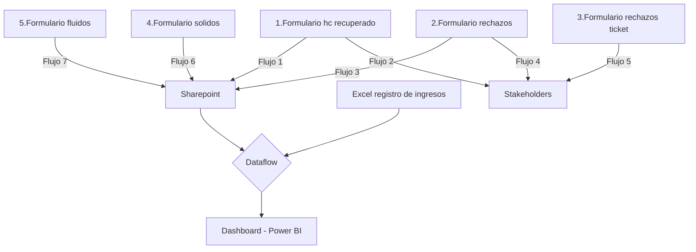
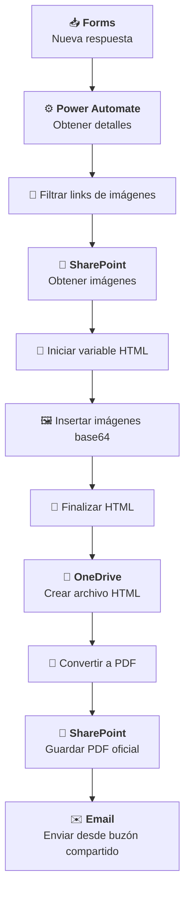

# Integración de reportes de laboratorio (Power Automate)

## Descripción del proyecto

**Problema:**
El laboratorio de la planta necesitaba optimizar la generación y distribución de reportes de análisis, que se realizaban de forma manual, generando demoras, errores y falta de trazabilidad en la información compartida entre áreas.

**Rol y aporte personal:**
Diseñé y desarrollé flujos automatizados en Power Automate que integran Microsoft Forms, SharePoint, OneDrive y correo corporativo, para estandarizar la creación de reportes, convertirlos automáticamente a PDF y distribuirlos a los responsables. Además, desarrollé un flujo de datos para procesos ETL y un tablero en Power BI para el seguimiento del laboratorio.

**Impacto logrado:**
La automatización permitió reducir un 40 % el tiempo de generación y envío de reportes, mejorar la trazabilidad y control documental, y asegurar la disponibilidad inmediata de la información para todas las áreas operativas y de gestión. 

## Desarrollo

**Integración de reportes de laboratorio**

Mediante una sencilla página web de sharepoint se centralizó la disponibilidad de todos los enlaces relevantes, mejorando el acceso y la navegación.

Los links superiores de la web de laboratorio corresponden a formularios que desencadenan distintos flujos automatizados:

1. Reportar un análisis de hidrocarburo recuperado
2. Reportar un rechazo (con análisis de laboratorio)
3. Reportar un rechazo (sin análisis de laboratorio)
4. Análisis de sólidos
5. Análisis de fluidos

Los 2 primeros reportes contienen 2 flujos automatizados cada uno, uno para la
generación, conversión, almacenamiento y distribución de reportes y uno
adicional que colecta la información en una única lista de sharepoint. El formulario 3 solo contiene un flujo que notifica a los stakeholders y en el
caso de los formularios de Analisis de sólido y fluidos, solo se colectan los datos ya que no requiere notificación.

### Flujo de trabajo

Los flujos 2, 4 y 5 se ocupan de la generación, conversión, almacenamiento y distribución de reportes. El flujo 5 está simplificado porque recolecta menos información que los numero 2 y 4.
Los flujos 1, 3, 6, y 7 solamente se ocupan de recolectar los registros en una lista de sharepoint.
La decisión de utilizar utilizar varios formularios es con el objetivo de hacerlos específicos a la información a cargar y que la misma sea obligatoria, para forzar la completitud de los datos y agilizar la carga.

**Nombre del flujo: Reporte de rechazo de unidad**

Este flujo representa la estructura de los flujos 2, 4 y 5 y su función es automatizar la generación, conversión, almacenamiento y distribución de reportes
de rechazo de unidades en el laboratorio de la planta de tratamiento y recuperación de residuos oleosos. A continuación se detalla su funcionamiento completo:

**🔹 Disparador**

- Se activa al recibir una nueva respuesta en el formulario 2: Reportar un rechazo (con análisis de laboratorio) o Formulario de rechazos. 
- Herramienta: Microsoft Forms.

**🔹 Extracción de datos**

- Recupera todos los campos relevantes de la respuesta, incluyendo:
    - Ticket
    - Fecha y hora
    - Manifiesto
    - Reporte
    - Motivo de rechazo
    - Transportista
    - Equipo
    - Unidad
    - Origen
    - Resultados del análisis (densidad, % aceite, % agua, % sólidos)
    - Volumen rechazado

**🔹 Procesamiento de imágenes**

- Extrae una lista de links desde un campo del formulario.
- Filtra los que contienen "link" y accede a SharePoint para obtener las imágenes.
- Inserta las imágenes en el HTML como bloques codificados en base64.

**🔹 Generación del documento**

- Construye un documento HTML con formato profesional.
- Incluye encabezado, secciones informativas, resultados, imágenes y pie de página.

**🔹 Conversión y almacenamiento**

- Guarda el HTML en OneDrive.
- Lo convierte a PDF.
- Finalmente, almacena el PDF en una carpeta específica de SharePoint para reportes oficiales.

**🔹 Distribución por correo**

- Envía un correo desde un buzón compartido a una lista de destinatarios internos.
- El correo incluye los datos clave del rechazo y adjunta el reporte PDF generado.

Este flujo garantiza
una trazabilidad completa del rechazo, desde la captura en el formulario hasta
la distribución del reporte, todo de forma automatizada y estandarizada.

## Arquitectura (Mermaid)

## Decisiones técnicas
- Formularios específicos para cada acción, priorizando la calidad de los datos y la agilidad en la carga.
- HTML→PDF en OneDrive permite crear PDFs sin licencias premium.
- Imágenes base64 para portabilidad.
- SharePoint como repositorio oficial documental (trazabilidad - sistema de gestión de calidad)
- Buzón compartido para ownership del envío y estandarización de e-mails.

### **Paso a paso del flujo**

**1. 🟢 Disparador: "Cuando se envía una respuesta nueva"**

- Se activa cuando se recibe una nueva respuesta en un formulario de Microsoft Forms.
- El formulario está identificado por un ID
- Usa un webhook para escuchar respuestas en tiempo real.

**2. 📥 Acción: "Obtener los detalles de la respuesta"**

- Recupera los datos completos de la respuesta enviada.
- Utiliza el response_id generado por el disparador para acceder a los campos específicos del formulario.

**3. 📝 Acción: "Redactar"**

- Extrae un campo específico de la respuesta.
- Este campo contiene una lista separada por comas. Corresponde a los links de las imágenes que se adjuntan en el formulario.

**4. 🧮 Acción: "Inicializar variable - IdList"**

- Crea una variable tipo array llamada IdList.
- Divide el contenido del campo redactado en elementos individuales usando split(). Para extraer las URLs de las imágenes

**5. 🔍 Acción: "Filtrar matriz"**

- Filtra los elementos del array IdList para quedarse solo con aquellos que contienen la palabra "link". Correspondientes a los enlaces de las imágenes.

**6. 🧪 Acción: "Inicializar variable - fileContent"**

- Crea una variable vacía tipo array llamada fileContent.
- Se usará más adelante para almacenar contenido (imágenes o archivos).

**7. 🧾 Acción: "Inicializar variable - html_doc"**

- Crea una variable tipo string llamada html_doc.
- Contiene una plantilla HTML completa para generar un reporte visual. 
- Incluye estilos CSS para formato A4, encabezados, secciones, contenedores flexibles, y soporte para impresión.

[2024_PowerAutomate_automatizacion_lab/templates/doc_html_informe.html](https://github.com/daianaagustini/Portfolio_PowerBI/blob/main/2024_PowerAutomate_automatizacion_lab/templates/doc_html_informe.html)

**8. 📂 Acción: "Obtener archivos (solo propiedades)"**

- Accede a una carpeta específica en SharePoint para obtener los archivos disponibles.
- Esta carpeta contiene las imágenes cargadas mediante el Forms.

**9. 🔁 Acción: "Aplicar a cada uno"**

- Itera sobre los elementos filtrados previamente (los que contienen "link").
- Dentro del bucle realiza varias acciones:

**a. 🧪 "Redactar_1" y "Redactar_2"**

- Decodifica y limpia la URL del archivo.

**b. 📥 "Obtener contenido de archivo mediante ruta de acceso"**

- Descarga el contenido del archivo desde SharePoint.

**c. 📄 "Obtener metadatos de archivo mediante ruta de acceso"**

- Recupera el nombre y otros metadatos del archivo.

**d. 📦 "Anexar a la variable de matriz"**

- Agrega el contenido del archivo a la variable fileContent.

**e. 🖼️ "Anexar a la variable de cadena 2"**

- Inserta la imagen en el HTML como un bloque  codificado en base64.
- El bucle está creado para recibir y almacenar varios archivos. Sin embargo, se limita el formulario a la carga de 1 solo archivo con un máximo de 1.4Mb.

**10. 🧩 Acción: "Anexar a la variable de cadena 2-copy"**

- Finaliza el documento HTML agregando el cierre de etiquetas y el pie de página.

**11. 🗂️ Acción: "Crear archivo 2"**

- Guarda el documento HTML en OneDrive.
- El nombre del archivo incluye el Manifiesto y la fecha de envío del ormulario de modo que sea un nombre único.

**12. 🔄 Acción: "Convertir un archivo mediante una ruta de acceso"**

- Convierte el archivo HTML en formato PDF usando OneDrive.

**13. 🗃️ Acción: "Crear archivo"**

- Guarda el archivo PDF final en una carpeta específica de SharePoint.
- En esta carpeta se guardan las evidencias e informes realizados por el laboratorio para el control documental y el sistema de gestión de excelencia operacional.

**14. 📧 Acción: "Enviar un correo electrónico desde un buzón compartido (V2)"**

- Envía un correo desde un buzón compartido.
- Destinatarios: múltiples correos de stakeholders (internos, del cliente y terceros), incluyendo áreas como logística, supervisión, jefatura y analistas de ambiente, ingenieros de proceso, gestión de calidad y trazabilidad.
- Asunto: “Rechazo de unidad [Unidad]”, donde la unidad se extrae del formulario.
- Cuerpo del mensaje:
    - Incluye detalles como unidad, pozo, equipo, manifiesto, transportista, motivo de rechazo y volumen rechazado.
    - Firma: “Laboratorio Planta TRON – Servicios ambientales AESA”.
- Adjunta el archivo PDF generado previamente con el reporte.
- El objetivo de este correo electrónico es notificar la unidad rechazada al área de logística para su gestión y otros stakeholders

## Conclusión
La implementación de estos flujos automatizados en Power Automate para la generación y gestión de reportes de laboratorio representó un avance significativo en la eficiencia operativa, trazabilidad y estandarización de procesos dentro del sistema de gestión ambiental de la planta.

La digitalización completa del ciclo —desde la captura de datos en Microsoft Forms hasta la distribución automatizada de reportes en PDF mediante SharePoint y correo corporativo— permitió eliminar tareas manuales repetitivas, reducir errores humanos y garantizar la disponibilidad inmediata de la información para todas las áreas involucradas.

Entre los principales beneficios alcanzados se destacan:

- Reducción del tiempo (en al menos 40%) de confección y distribución de reportes, pasando de procesos manuales a flujos automáticos que operan en segundos.

- Trazabilidad total de cada registro, desde el formulario de entrada hasta el almacenamiento y notificación final. Permitiendo

-  Estandarización y control documental, al centralizar los archivos oficiales en SharePoint con nomenclaturas y ubicaciones consistentes.

-  Mayor calidad y disponibilidad de los datos, facilitando su análisis posterior y la toma de decisiones. Se desarrolló un tablero en Power BI para la evaluación y mejora de la eficiencia y confiabilidad del laboratorio.

-  Integración transparente entre herramientas corporativas disponibles de Microsoft (Forms, SharePoint, OneDrive, Outlook), sin necesidad de desarrollos externos o costos extras.

Estas soluciones no solo mejoran la productividad del laboratorio, sino que sientan las bases para una cultura de automatización y mejora continua, alineada con los principios de excelencia operacional y sostenibilidad tecnológica de la organización.

# Tablero en Power BI
 ## Introducción
 En sus inicios, los reportes de resultados agregados del laboratorio se presentaban mensualmente mediante archivos en PowerPoint, a modo de informe. El primer modelo de tablero se desarrolló tomando como base esa presentación, incorporando gráficos adicionales y aprovechando las capacidades interactivas de Power BI. Gracias a la segmentación mensual automatizada, ya no fue necesario generar manualmente los informes en PowerPoint.
 Con el uso progresivo del tablero, comenzaron a detectarse deficiencias en la calidad de los datos, como problemas de consistencia, completitud y unicidad. La incorporación de un proceso ETL automatizado permitió mejorar significativamente el seguimiento de los resultados y de la actividad del laboratorio.
 El laboratorio es una pieza clave dentro del funcionamiento de la planta de tratamiento, y su confiabilidad resulta esencial para el proceso. El tablero permite un monitoreo integrado y diario de la actividad, lo que facilita la identificación de puntos críticos y la anticipación a posibles desvíos.

 ## Descripción de la temática de los datos
 Los datos presentados en este tablero corresponden a los registros de residuos anunciados en planta (que posteriormente se reciben o rechazan) y resultados analíticos generados por el laboratorio de estos rechazos y parámetros de la planta, como sólidos e hidrocarburo recuperado. Los parámetros incluyen composición de las muestras en porcentaje de fases (solido, agua e hidrocarburo) y densidad. 

 ## Objetivo
 Facilitar el monitoreo integral de los procesos operativos y de calidad del laboratorio, permitiendo visualizar en tiempo real los motivos y ca rechazos por equipo, analizar las características de las corrientes de ingreso y las de salida ( hidrocarburo recuperado y sólidos), así como realizar un seguimiento detallado de la actividad del laboratorio mediante indicadores clave de desempeño (KPIs), promoviendo así la toma de decisiones informadas y la mejora continua.

 ## Nivel de aplicación de análisis
 - laboratoristas: seguimiento de la actividad, calidad de datos y KPIs
 - Ingeniaría de procesos:  seguimiento de la calidad de las corrientes de ingreso y egreso. control de proceso.
 - Jefatura y gerencia: control de la confiabilidad, calidad y eficiencia del laboratorio.

 ## Base de datos
 Los datos se encuentran alojados en un equipo de trabajo en sharepoint, a partir de los flujos automatizados de power automate y el dataflow gen1 se cargan y transforman los datos para disponibilizarlos en power bi para la creacion del tablero.
 ! Los datos incluidos en este portfolio han sido modificados con el fin de preservar la privacidad. No corresponden a los registros originales. El propósito de este material es exclusivamente mostrar el desarrollo técnico y funcional del tablero.

 1. **Tablas**
 - [Calendario]
 - [Horas]
 - [Rechazos_Ingresos_AESA]
 - [Resumen]

 2. **Diagrama entidad-relación**
  
 3. **Tabla de versionado**
   a. Transformaciones de datos en power query

    Las tablas [rechazos_ingresos_AESA] y [horas] son tablas importadas desde el flujo de datos Gen1 creado en Power BI Service, por lo que las transformaciones principales se alojan allí

    La tabla [Ingresos_rechazos_AESA]  en el flujo se compone de tres tablas:

    Una correspondiente a datos curados del año, correspondiente a los últimos meses naturales. En esta tabla se guardan los datos ya unificados y revisados a mes cerrado.
    - [ingresos_rechazos_lab]
    Dos tablas  que construyen los datos del mes en curso:
     - [rechazos_ingresos_aesa]
     - [analisis de laboratorio_procesado]

    La tabla horas se importa desde el flujo y se reducen las filas y columnas en power query para solo cargar los datos requeridos para el tablero.

    **Transformaciones dataflow Gen1**
    [ingresos_rechazos_lab]

      let
  Origen = SharePoint.Files("https://sharepoint.com/sites", [ApiVersion = 15]),
  #"Filas filtradas" = Table.SelectRows(Origen, each [Extension] = ".xlsx" and [Folder Path] = "https://sharepoint.com/sites/folder"),
  #"ingresos_rechazos_lab_2025 xlsx_https://sharepoint.com/sites/folder" = #"Filas filtradas"{[Name = "ingresos_rechazos_lab_2025.xlsx", #"Folder Path" = "https://sharepoint.com/sites/folder"]}[Content],
  #"Libro de Excel importado" = Excel.Workbook(#"ingresos_rechazos_lab_2025 xlsx_https://sharepoint.com/sites/folder"),
  Hoja2_Sheet = #"Libro de Excel importado"{[Item = "Hoja2", Kind = "Sheet"]}[Data],
  #"Encabezados promovidos" = Table.PromoteHeaders(Hoja2_Sheet, [PromoteAllScalars = true]),
  #"Tipo cambiado" = Table.TransformColumnTypes(#"Encabezados promovidos", {{"Fecha", type date}, {"Hora_de_anuncio", type text}, {"Hora_de_ingreso", type text}, {"Transportista", type text}, {"Unidad", type any}, {"Tipo_transporte", type text}, {"Manifiesto", type any}, {"Origen", type text}, {"Equipo", type text}, {"Base", type text}, {"Tipo_de_residuo", type text}, {"Csc_dto_2263/15", type text}, {"Estado", type text}, {"Vol_recibido_m3", Int64.Type}, {"Vol_recibido_piletas_aesa_m3", Int64.Type}, {"Pileta_aesa", type text}, {"Vol_a_pileta_de_repo_m3", Int64.Type}, {"Pileta_repositorio", type text}, {"Vol_a_acopio_de_aesa_m3", Int64.Type}, {"Vol_rechazado_m3", type number}, {"Motivo", type text}, {"Ticket_n", type any}, {"Reporte_n", type any}, {"Hora_de_egreso_rechazo", type text}, {"Observaciones", type text}, {"Densidad_gr-cm3", type any}, {"Retorta_oil", type any}, {"Retorta_agua", type any}, {"Retorta_solidos", type any}, {"humectacion", type any}}),
  #"Valor reemplazado" = Table.ReplaceValue(#"Tipo cambiado", "31/12/1899 ", "", Replacer.ReplaceText, {"Hora_de_ingreso"}),
  #"Valor reemplazado 1" = Table.ReplaceValue(#"Valor reemplazado", "31/12/1899 ", "", Replacer.ReplaceText, {"Hora_de_anuncio"}),
  #"Valor reemplazado 2" = Table.ReplaceValue(#"Valor reemplazado 1", "31/12/1899 ", "", Replacer.ReplaceText, {"Hora_de_egreso_rechazo"}),

  // Formatear horas (rellenar ceros y agregar ":")
    #"Horas formateadas" = Table.TransformColumns(#"Valor reemplazado 2", {
        
        {"Hora_de_anuncio", each if _ <> null and not Text.Contains(_, ":") then Text.Insert(Text.PadStart(Text.From(_), 4, "0"), 2, ":") else _, type text},
        {"Hora_de_ingreso", each if _ <> null and not Text.Contains(_, ":") then Text.Insert(Text.PadStart(Text.From(_), 4, "0"), 2, ":") else _, type text},
        {"Hora_de_egreso_rechazo", each if _ <> null and not Text.Contains(_, ":") then Text.Insert(Text.PadStart(Text.From(_), 4, "0"), 2, ":") else _, type text}
       
    }),
  //Limpiar símbolos
   #"Limpiar simbolos" = Table.TransformColumns(#"Horas formateadas", {
        {"Hora_de_anuncio", each if _ <> null and (Text.Contains(_, "/") or Text.Contains(_, ",") or Text.Contains(_, "-")) then null else _, type time},
        {"Hora_de_ingreso", each if _ <> null and (Text.Contains(_, "/") or Text.Contains(_, ",") or Text.Contains(_, "-")) then null else _, type time},
        {"Hora_de_egreso_rechazo", each if _ <> null and (Text.Contains(_, "/") or Text.Contains(_, ",") or Text.Contains(_, "-")) then null else _, type time}

   }),

  // Filtro para los ultimos 12 meses naturales (no debe incluir el mes en curso)
  #"Filas filtradas1" = Table.SelectRows(#"Limpiar simbolos", each Date.IsInPreviousNMonths([Fecha], 12)),
  #"Filas ordenadas" = Table.Sort(#"Filas filtradas1", {{"Fecha", Order.Descending}}),
  #"Transformar columnas" = Table.TransformColumnTypes(#"Filas ordenadas", {{"Unidad", type text}, {"Manifiesto", type text}, {"Ticket_n", type text}, {"Reporte_n", type text}, {"Densidad_gr-cm3", type text}, {"Retorta_oil", type text}, {"Retorta_agua", type text}, {"Retorta_solidos", type text}, {"humectacion", type text}}),
  #"Tipo de columna cambiado" = Table.TransformColumnTypes(#"Transformar columnas", {{"Hora_de_anuncio", type time}, {"Hora_de_ingreso", type time}, {"Hora_de_egreso_rechazo", type time}}),
  #"Reemplazar errores" = Table.ReplaceErrorValues(#"Tipo de columna cambiado", {{"Unidad", null}, {"Manifiesto", null}, {"Ticket_n", null}, {"Reporte_n", null}, {"Densidad_gr-cm3", null}, {"Retorta_oil", null}, {"Retorta_agua", null}, {"Retorta_solidos", null}, {"humectacion", null}})
 in
    #"Reemplazar errores"

    **[rechazos_ingresos_aesa]**

    let
    // 1. Conexión y carga
    Origen = SharePoint.Files("https://sharepoint.com/sites", [ApiVersion = 15]),
    #"Filas filtradas" = Table.SelectRows(Origen, each [Extension] = ".xlsx" and [Name] = "FORMULARIO REGISTRO DE CONTROL DE INGRESOS Y RECHAZOS.xlsx"),
    Navegación = #"Filas filtradas"{[Name = "FORMULARIO REGISTRO DE CONTROL DE INGRESOS Y RECHAZOS.xlsx", #"Folder Path" = "https://sharepoint.com/sites/folder"]}[Content],
    #"Libro de Excel importado" = Excel.Workbook(Navegación, null, true),
    #"Navegación 1" = #"Libro de Excel importado"{[Item = "CONTROL DE INGRESO", Kind = "Sheet"]}[Data],

    // 2. Limpiar filas y promover encabezados
    #"Filas superiores quitadas" = Table.Skip(#"Navegación 1", 3),
    #"Encabezados promovidos" = Table.PromoteHeaders(#"Filas superiores quitadas", [PromoteAllScalars = true]),

    // 3. Renombrar columnas
    #"Columnas renombradas" = Table.RenameColumns(#"Encabezados promovidos", {
        {"Fecha Entrada", "Fecha"}, {"ID Unidad", "Unidad"}, {"Tipo", "Tipo_transporte"},
        {"Origen Pozo / Instalación", "Origen"}, {"Tipo de residuo", "Tipo_de_residuo"},
        {"CSC DTO 2263/15", "Csc_dto_2263/15"}, {"ESTADO", "Estado"},
        {"Vol. total recibido (m³)", "Vol_recibido_m3"}, {"Vol. Recibido piletas AESA (m³)", "Vol_recibido_piletas_aesa_m3"},
        {"Pileta AESA", "Pileta_aesa"}, {"Vol. a pileta de Repo.  (m³)", "Vol_a_pileta_de_repo_m3"},
        {"Pileta REPOSITORIO", "Pileta_repositorio"}, {"Vol. a acopio de AESA (m³)", "Vol_a_acopio_de_aesa_m3"},
        {"Vol. rechazado (m³)", "Vol_rechazado_m3"}, {"Ticket N°", "Ticket_n"}, {"Reporte N°", "Reporte_n"},
        {"DENSIDAD (gr/cm3)", "Densidad_gr-cm3"}, {"%OIL", "Retorta_oil"}, {"%AGUA", "Retorta_agua"},
        {"%SOLIDOS", "Retorta_solidos"}, {"Hora de anuncio", "Hora_de_anuncio"},
        {"Hora de ingreso", "Hora_de_ingreso"}, {"Hora de egreso / rechazo", "Hora_de_egreso_rechazo"}
    }),

    // 4. Filtrar por mes actual
    #"Filas filtradas1" = Table.SelectRows(#"Columnas renombradas", each Date.IsInCurrentMonth([Fecha])),

    // 5. Cambiar tipos (solo columnas críticas)
    #"Tipos cambiados" = Table.TransformColumnTypes(#"Filas filtradas1", {
        {"Fecha", type date}, {"Vol_recibido_m3", Int64.Type}, {"Vol_recibido_piletas_aesa_m3", Int64.Type},
        {"Vol_a_pileta_de_repo_m3", Int64.Type}, {"Vol_rechazado_m3", Int64.Type}, {"Ticket_n", Int64.Type},
        {"Transportista", type text}, {"Manifiesto", type text}, {"Reporte_n", type text},
        {"Densidad_gr-cm3", type text}, {"Retorta_oil", type text}, {"Retorta_agua", type text},
        {"Retorta_solidos", type text}, {"Total", type text}, {"Hora_de_anuncio", type text},
        {"Hora_de_ingreso", type text}, {"Hora_de_egreso_rechazo", type text}
    }),

    // 6. Reemplazar errores y limpiar filas inválidas
    #"Reemplazar errores" = Table.ReplaceErrorValues(#"Tipos cambiados", {
        {"Transportista", null}, {"Manifiesto", null}, {"Reporte_n", null},
        {"Densidad_gr-cm3", null}, {"Retorta_oil", null}, {"Retorta_agua", null},
        {"Retorta_solidos", null}, {"Total", null}
    }),
    #"Errores quitados" = Table.RemoveRowsWithErrors(#"Reemplazar errores", {"Tipo_transporte", "Transportista", "Fecha"}),
  #"Valor reemplazado" = Table.ReplaceValue(#"Errores quitados", "11547", "1547", Replacer.ReplaceText, {"Hora_de_ingreso"}),

    // 7. Formatear horas (rellenar ceros y agregar ":")
    #"Horas formateadas" = Table.TransformColumns(#"Valor reemplazado", {
        {"Hora_de_anuncio", each if _ <> null then Text.Insert(Text.PadStart(Text.From(_), 4, "0"), 2, ":") else null, type text},
        {"Hora_de_ingreso", each if _ <> null then Text.Insert(Text.PadStart(Text.From(_), 4, "0"), 2, ":") else null, type text},
        {"Hora_de_egreso_rechazo", each if _ <> null then Text.Insert(Text.PadStart(Text.From(_), 4, "0"), 2, ":") else null, type text}
    }),

    // 8. Limpiar símbolos (/, ,, -)
    #"Limpiar simbolos" = Table.TransformColumns(#"Horas formateadas", {
        {"Hora_de_anuncio", each if _ <> null and (Text.Contains(_, "/") or Text.Contains(_, ",") or Text.Contains(_, "-")) then null else _, type text},
        {"Hora_de_ingreso", each if _ <> null and (Text.Contains(_, "/") or Text.Contains(_, ",") or Text.Contains(_, "-")) then null else _, type text},
        {"Hora_de_egreso_rechazo", each if _ <> null and (Text.Contains(_, "/") or Text.Contains(_, ",") or Text.Contains(_, "-")) then null else _, type text}
    }),

    // 9. Convertir a tipo hora
    #"Convertir a hora" = Table.TransformColumnTypes(#"Limpiar simbolos", {
        {"Hora_de_anuncio", type time}, {"Hora_de_ingreso", type time}, {"Hora_de_egreso_rechazo", type time}
    })
  in
    #"Convertir a hora"

  **[analisis de laboratorio_procesado]**
   
   let
    // 1. Conexión y carga desde SharePoint
    Origen = SharePoint.Tables("https://sharepoint.com/sites", [Implementation = "2.0", ViewMode = "All"]),
    TablaOrigen = Origen{[Id = "0000000-000000-000000"]}[Items],
    // 2. Filtrar por año actual y fecha > 2024-12-31 (con conversión segura)
    #"Filas filtradas" = Table.SelectRows(TablaOrigen, each Date.IsInCurrentYear(Date.From([#"Fecha "])) and Date.From([#"Fecha "]) > #date(2024, 12, 31)),
    // 3. Seleccionar columnas necesarias
    #"Columnas seleccionadas" = Table.SelectColumns(#"Filas filtradas", {
        "Título", "Fecha ", "Tratamiento", "Equipo", "Muestra", "Densidad (g/cm3)",
        "Retorta Fluido Oil", "Retorta Fluido H2O", "Retorta Fluido Sólidos", "% humectacion",
        "Velocidad Bowl", "Velocidad diferencial", "Torque", "RPM"
    }),
    // 4. Renombrar columnas
    #"Columnas renombradas" = Table.RenameColumns(#"Columnas seleccionadas", {
        {"Retorta Fluido Oil", "Retorta_oil"}, {"Retorta Fluido H2O", "Retorta_agua"},
        {"Retorta Fluido Sólidos", "Retorta_solidos"}, {"Título", "Base"}, {"Tratamiento", "Estado"},
        {"Muestra", "Csc_dto_2263/15"}, {"Densidad (g/cm3)", "Densidad_g-cm3"}, {"% humectacion", "humectacion"},
        {"Fecha ", "Fecha"}
    }),
    // 5. Convertir tipos en bloque
    #"Tipos cambiados" = Table.TransformColumnTypes(#"Columnas renombradas", {
        {"Fecha", type date}, {"RPM", type number}, {"Torque", type number},
        {"Velocidad diferencial", type number}, {"Velocidad Bowl", type number},
        {"Base", type text}, {"Retorta_oil", type number}, {"Retorta_agua", type number},
        {"Retorta_solidos", type number}, {"humectacion", type text}
    }),
    // 6. Reemplazar valores nulos en Retorta
    #"Valores reemplazados" = Table.ReplaceValue(#"Tipos cambiados", null, 0, Replacer.ReplaceValue, {"Retorta_oil", "Retorta_agua", "Retorta_solidos"}),
    // 7. Agregar columna Retorta (Si/No)
    #"Columna Retorta" = Table.AddColumn(#"Valores reemplazados", "Retorta", each if [Retorta_oil] + [Retorta_agua] + [Retorta_solidos] > 0 then "Si" else "No", type text),
    // 8. Filtrar filas con Retorta = "Si" y Estado = "Procesado" y mes actual
    #"Filas filtradas finales" = Table.SelectRows(#"Columna Retorta", each [Retorta] = "Si" and [Estado] = "Procesado" and Date.IsInCurrentMonth([Fecha])),
    // 9. Eliminar columna Retorta y ordenar por fecha
    #"Columnas quitadas" = Table.RemoveColumns(#"Filas filtradas finales", {"Retorta"}),
    #"Filas ordenadas" = Table.Sort(#"Columnas quitadas", {{"Fecha", Order.Descending}})
  in
    #"Filas ordenadas"

  **[rechazos_ingresos_AESA]**
  let
   // 1. Combinar tablas
   Origen = Table.Combine({rechazos_Ingresos_lab_aesa, ingresos_rechazos_lab_2025, #"Análisis de Laboratorio_procesado"}),
   // 2. Convertir tipos en un solo bloque
   #"Tipos cambiados" = Table.TransformColumnTypes(Origen, {{"Vol_recibido_m3", type number}, {"Vol_recibido_piletas_aesa_m3", type number},  {"Vol_a_pileta_de_repo_m3", type number}, {"Vol_a_acopio_de_aesa_m3", type number}, {"Vol_rechazado_m3", type number}, {"Retorta_oil", type number},  {"Densidad_gr-cm3", type number}, {"Retorta_agua", type number}, {"Retorta_solidos", type number}, {"Fecha", type date}}),
   // 3. Ordenar por fecha descendente
   #"Filas ordenadas" = Table.Sort(#"Tipos cambiados", {{"Fecha", Order.Descending}}),
   #"Transformar columnas" = Table.TransformColumnTypes(#"Filas ordenadas", {{"Unidad", type text}, {"Tipo_transporte", type text}, {"Origen", type text}, {"Equipo", type text}, {"Base", type text}, {"Tipo_de_residuo", type text}, {"Csc_dto_2263/15", type text}, {"Estado", type text}, {"Pileta_aesa", type text}, {"Pileta_repositorio", type text}, {"Motivo", type text}, {"Ticket_n", type text}, {"Observaciones", type text}, {"Velocidad Bowl", type text}, {"Velocidad diferencial", type text}, {"Torque", type text}, {"RPM", type text}}),
   #"Reemplazar errores" = Table.ReplaceErrorValues(#"Transformar columnas", {{"Unidad", null}, {"Tipo_transporte", null}, {"Origen", null}, {"Equipo", null}, {"Base", null}, {"Tipo_de_residuo", null}, {"Csc_dto_2263/15", null}, {"Estado", null}, {"Pileta_aesa", null}, {"Pileta_repositorio", null}, {"Motivo", null}, {"Ticket_n", null}, {"Observaciones", null}, {"Velocidad Bowl", null}, {"Velocidad diferencial", null}, {"Torque", null}, {"RPM", null}})
 in
  #"Reemplazar errores"

**[horas]**
 let
   Origen = Table.Combine({Horas_Y20BA, Horas_Y14NBO, Horas_Y20BO}),
   #"Tipo de columna cambiado" = Table.TransformColumnTypes(Origen, {{"HNProd.1", Int64.Type}, {"HNProd.2", Int64.Type}, {"HNProd.3", Int64.Type}, {"Razon 3", type  text}, {"Fecha ", type date}, {"Base", type text}}),
   #"Columnas con nombre cambiado" = Table.RenameColumns(#"Tipo de columna cambiado", {{"Fecha ", "Fecha"}}),
   #"Filas filtradas" = Table.SelectRows(#"Columnas con nombre cambiado", each [Fecha] >= #date(2025, 10, 1))
 in
   #"Filas filtradas"

Transformaciones especificas para el tablero en power query
 let
   Origen = PowerBI.Dataflows(null),
   #"0000-00000-000-0000" = Origen{[workspaceId="0000-0000-000-0000"]}[Data],
   #"0000-00000-000-0000" = #"0000-00000-000-0000"{[dataflowId="0000-00000-000-0000"]}[Data],
   Horas = #"0000-00000-000-0000"{[entity="Horas"]}[Data],
   #"Otras columnas quitadas" = Table.SelectColumns(Horas,{"Fecha", "HProd.", "Base"}),
   #"Filas filtradas" = Table.SelectRows(#"Otras columnas quitadas", each ([Base] = "Base Oil"))
 in
     #"Filas filtradas"

## Tablas creadas con DAX

 Calendario = 
VAR MinFecha = FIRSTDATE('rechazos_Ingresos_AESA'[Fecha])
VAR MaxFecha = TODAY()
RETURN
ADDCOLUMNS(
    CALENDAR(MinFecha, MaxFecha),
    "Año", YEAR([Date]),
    "MesNum", MONTH([Date]),
    "Mes", FORMAT([Date], "MMMM"),
    "MesCorto", FORMAT([Date], "MMM"),
    "Trimestre", "Q" & FORMAT([Date], "Q"),
    "SemNum", WEEKNUM([Date], 2),
    "SemDia", WEEKDAY([Date], 2),
    "Dia", DAY([Date]),
    "NombreDia", FORMAT([Date], "dddd"),
    "NombreDiaCorto", FORMAT([Date], "ddd"),
    "EsFinDeSemana", IF(WEEKDAY([Date], 2) > 5, TRUE(), FALSE()),
    "AñoMes", FORMAT([Date], "YYYY-MM")
)
//Tabla calendario. Se selecciona como tabla de fechas en el modelo de datos

## Columnas calculadas
Se crean 4 columnas calculadas en la tabla ingresos_rechazos, relacionadas a la calidad de datos:

**Datos completos** = 
IF (
    rechazos_Ingresos_AESA[Retorta] = "Si" &&
    NOT (
        ISBLANK(rechazos_Ingresos_AESA[Fecha]) ||
        ISBLANK(rechazos_Ingresos_AESA[Equipo]) ||
        ISBLANK(rechazos_Ingresos_AESA[Csc_dto_2263/15]) ||
        ISBLANK(rechazos_Ingresos_AESA[Estado]) ||
        ISBLANK(rechazos_Ingresos_AESA[Base])
    ),
    1,
    BLANK()
)
-- Esta columna verifica si un registro tiene todos los campos clave completos
-- (Fecha, Equipo, Csc_dto_2263/15, Estado, Base) únicamente cuando el campo Retorta es "Si".
-- Si alguno de esos campos está en blanco, devuelve BLANK(); si todos están completos, devuelve 1.
-- Se utiliza para filtrar registros válidos en análisis de calidad de datos o consistencia operativa.

**Retorta suma** = rechazos_Ingresos_AESA[Retorta_agua]+rechazos_Ingresos_AESA[Retorta_oil]+rechazos_Ingresos_AESA[Retorta_solidos]
-- Esta medida verifica los datos de los analisis realizados. Resultados diferentes de 100 deben corregirse.

**Datos correctos** = IF(rechazos_Ingresos_AESA[Retorta suma]=100,1,0)
-- esta medida arroja 1 (True) o 0 (False) dependiendo si la columna [Retorata suma] es igual a 100 o no

**Retorta** = IF(rechazos_Ingresos_AESA[Retorta_agua]+rechazos_Ingresos_AESA[Retorta_oil]+rechazos_Ingresos_AESA[Retorta_solidos]>0, "Si", "No")
-- Esta medida verifica si el registro contiene o no un análisis de retorta.

 
## Medidas calucladas
26 medidas calculadas

**# Rechazos** =
CALCULATE (
    COUNT ( rechazos_Ingresos_AESA[Fecha] ),
    rechazos_Ingresos_AESA[Estado] IN { "Rechazado", "Rechazo parcial" }
)
// Esta medida calcula el número total de registros en la tabla 'rechazos_Ingresos_AESA' donde el campo [Estado] sea "Rechazado" o "Rechazo parcial".

**# Retortas** = 
COALESCE(
    CALCULATE(
        COUNT('rechazos_Ingresos_AESA'[Retorta]),
        'rechazos_Ingresos_AESA'[Retorta] = "Si"
    ),
    0
)
// Esta medida cuenta la cantidad de registros en la tabla 'rechazos_Ingresos_AESA'donde el campo [Retorta] tiene el valor "Si".

**%agua promedio rechazo** =
CALCULATE (
    AVERAGE ( rechazos_Ingresos_AESA[Retorta_agua] ),
    rechazos_Ingresos_AESA[Estado] = "Rechazado",
    NOT ISBLANK ( rechazos_Ingresos_AESA[Retorta_agua] ),
    rechazos_Ingresos_AESA[Retorta_solidos] + rechazos_Ingresos_AESA[Retorta_oil] > 0
)

**%agua promedio rechazo** = 
CALCULATE (
    AVERAGE ( rechazos_Ingresos_AESA[Retorta_agua] ),
    rechazos_Ingresos_AESA[Estado] = "Rechazado",
    NOT ISBLANK ( rechazos_Ingresos_AESA[Retorta_agua] ),
    rechazos_Ingresos_AESA[Retorta_solidos] + rechazos_Ingresos_AESA[Retorta_oil] > 0
)
// Esta medida calcula el promedio del campo [Retorta_agua] en la tabla 'rechazos_Ingresos_AESA', considerando únicamente los registros con estado "Rechazado", donde [Retorta_agua] no esté en blanco y la suma de [Retorta_solidos] + [Retorta_oil] sea mayor a 0 (es decir, que efectivamente exista un análisis)

**%agua promedio solido** = 
CALCULATE(
    AVERAGE(rechazos_Ingresos_AESA[Retorta_agua]),
    rechazos_Ingresos_AESA[Csc_dto_2263/15] = "Solido",
    NOT ISBLANK(rechazos_Ingresos_AESA[Retorta_agua]),
    rechazos_Ingresos_AESA[Retorta_solidos] + rechazos_Ingresos_AESA[Retorta_oil] > 0
)
// Esta medida calcula el promedio del campo [Retorta_agua] para los registros de tipo "Solido" en la columna [Csc_dto_2263/15], siempre que [Retorta_agua] no esté en blanco y la suma de [Retorta_solidos] + [Retorta_oil] sea mayor a 0.

**%oil promedio rechazo** = 
CALCULATE(
    AVERAGE(rechazos_Ingresos_AESA[Retorta_oil]),
    rechazos_Ingresos_AESA[Estado] = "Rechazado",
    NOT ISBLANK(rechazos_Ingresos_AESA[Retorta_oil]),
    rechazos_Ingresos_AESA[Retorta_oil] + rechazos_Ingresos_AESA[Retorta_agua] > 0
)
// Esta medida calcula el promedio del campo [Retorta_oil] para los registros con estado "Rechazado", siempre que [Retorta_oil] no esté en blanco y la suma de [Retorta_oil] + [Retorta_agua] sea mayor a 0.

**%oil promedio solido** = 
CALCULATE(
    AVERAGE(rechazos_Ingresos_AESA[Retorta_oil]),
    rechazos_Ingresos_AESA[Csc_dto_2263/15] = "Solido",
    NOT ISBLANK(rechazos_Ingresos_AESA[Retorta_oil]),
    rechazos_Ingresos_AESA[Retorta_oil] > 0
)
// Esta medida calcula el promedio del campo [Retorta_oil] para los registros de tipo "Solido" en la columna [Csc_dto_2263/15], siempre que [Retorta_oil] no esté en blanco y sea mayor a 0.

**%solidos promedio rechazo**= 
CALCULATE(
    AVERAGE(rechazos_Ingresos_AESA[Retorta_solidos]),
    rechazos_Ingresos_AESA[Estado] = "Rechazado",
    NOT ISBLANK(rechazos_Ingresos_AESA[Retorta_solidos]),
    rechazos_Ingresos_AESA[Retorta_solidos] + rechazos_Ingresos_AESA[Retorta_oil] > 0
)
// Esta medida calcula el promedio del campo [Retorta_solidos] para los registros con estado "Rechazado", siempre que [Retorta_solidos] no esté en blanco y la suma de [Retorta_solidos] + [Retorta_oil] sea mayor a 0.

**%solidos promedio solido** = 
CALCULATE(
    AVERAGE(rechazos_Ingresos_AESA[Retorta_solidos]),
    rechazos_Ingresos_AESA[Csc_dto_2263/15] = "Solido",
    NOT ISBLANK(rechazos_Ingresos_AESA[Retorta_solidos]),
    rechazos_Ingresos_AESA[Retorta_solidos] + rechazos_Ingresos_AESA[Retorta_oil] > 0
)
// Esta medida calcula el promedio del campo [Retorta_solidos] para los registros de tipo "Solido" en la columna [Csc_dto_2263/15], siempre que [Retorta_solidos] no esté en blanco y la suma de[Retorta_solidos] + [Retorta_oil] sea mayor a 0.

**%Vo. Rechazado** = 
ROUND(
    DIVIDE(
        SUM(rechazos_Ingresos_AESA[Vol_rechazado_m3]),
        SUM(rechazos_Ingresos_AESA[Vol_rechazado_m3]) + SUM(rechazos_Ingresos_AESA[Vol_recibido_m3]),
        0
    ),
    2
)
// Esta medida calcula el porcentaje de volumen rechazado sobre el volumen total (rechazado + recibido). 

**BO %agua promedio HC** = 
ROUND(
    CALCULATE(
        AVERAGE(rechazos_Ingresos_AESA[Retorta_agua]),
        rechazos_Ingresos_AESA[Base] = "Base Oil",
        rechazos_Ingresos_AESA[Csc_dto_2263/15] = "HC Recuperado",
        NOT ISBLANK(rechazos_Ingresos_AESA[Retorta_agua])
    ),
    0
)
// Esta medida calcula el promedio del campo [Retorta_agua] para los registros con base "Base Oil" y tipo "HC Recuperado", excluyendo valores en blanco.

**BO %agua promedio ingreso** = 
CALCULATE(
    AVERAGE(rechazos_Ingresos_AESA[Retorta_agua]),
    rechazos_Ingresos_AESA[Base] = "Base Oil",
    rechazos_Ingresos_AESA[Estado] = "Recibido",
    NOT ISBLANK(rechazos_Ingresos_AESA[Retorta_agua]),
    rechazos_Ingresos_AESA[Retorta_solidos] + rechazos_Ingresos_AESA[Retorta_agua] > 0
)
// Esta medida calcula el promedio del campo [Retorta_agua] para los registros con base "Base Oil"  y estado "Recibido", excluyendo valores en blanco y considerando solo aquellos donde la suma de [Retorta_solidos] + [Retorta_agua] sea mayor a 0.

**BO %oil promedio HC** = 
ROUND(
    CALCULATE(
        AVERAGE(rechazos_Ingresos_AESA[Retorta_oil]),
        rechazos_Ingresos_AESA[Base] = "Base Oil",
        rechazos_Ingresos_AESA[Csc_dto_2263/15] = "HC Recuperado",
        NOT ISBLANK(rechazos_Ingresos_AESA[Retorta_oil])
    ),
    2
)
// Esta medida calcula el promedio del campo [Retorta_oil] para los registros con base "Base Oil" y tipo "HC Recuperado", excluyendo valores en blanco.

**BO %oil promedio ingreso** = 
CALCULATE(
    AVERAGE(rechazos_Ingresos_AESA[Retorta_oil]),
    rechazos_Ingresos_AESA[Base] = "Base Oil",
    rechazos_Ingresos_AESA[Estado] = "Recibido",
    NOT ISBLANK(rechazos_Ingresos_AESA[Retorta_oil]),
    rechazos_Ingresos_AESA[Retorta_solidos] + rechazos_Ingresos_AESA[Retorta_oil] > 0
)
// Esta medida calcula el promedio del campo [Retorta_oil] para los registros con base "Base Oil" y estado "Recibido", excluyendo valores en blanco y considerando solo aquellos donde la suma de [Retorta_solidos] + [Retorta_oil] sea mayor a 0.

**BO %solidos promedio ingreso** = 
CALCULATE(
    AVERAGE(rechazos_Ingresos_AESA[Retorta_solidos]),
    rechazos_Ingresos_AESA[Base] = "Base Oil",
    rechazos_Ingresos_AESA[Estado] = "Recibido",
    NOT ISBLANK(rechazos_Ingresos_AESA[Retorta_solidos]),
    rechazos_Ingresos_AESA[Retorta_solidos] + rechazos_Ingresos_AESA[Retorta_oil] > 0
)
// Esta medida calcula el promedio del campo [Retorta_solidos] para los registros con base "Base Oil" y estado "Recibido", excluyendo valores en blanco y considerando solo aquellos donde la suma de [Retorta_solidos] + [Retorta_oil] sea mayor a 0.

**BO densidad promedio HC** = 
CALCULATE(
    AVERAGE(rechazos_Ingresos_AESA[Densidad_gr-cm3]),
    rechazos_Ingresos_AESA[Base] = "Base Oil",
    rechazos_Ingresos_AESA[Csc_dto_2263/15] = "HC Recuperado",
    NOT ISBLANK(rechazos_Ingresos_AESA[Densidad_gr-cm3])
)
// Esta medida calcula el promedio del campo [Densidad_gr-cm3] para los registros con base "Base Oil" y tipo "HC Recuperado", excluyendo valores en blanco.

**BO densidad promedio ingreso** = 
CALCULATE(
    AVERAGE(rechazos_Ingresos_AESA[Densidad_gr-cm3]),
    rechazos_Ingresos_AESA[Base] = "Base Oil",
    rechazos_Ingresos_AESA[Estado] = "Recibido",
    NOT ISBLANK(rechazos_Ingresos_AESA[Densidad_gr-cm3])
)
// Esta medida calcula el promedio del campo [Densidad_gr-cm3] para los registros con base "Base Oil" y estado "Recibido", excluyendo valores en blanco.

**BO vol. rechazado** = 
CALCULATE(
    SUM(rechazos_Ingresos_AESA[Vol_rechazado_m3]),
    rechazos_Ingresos_AESA[Base] = "Base oil",
    rechazos_Ingresos_AESA[Estado] IN { "Rechazado", "Rechazado Parcial" }
)
// Esta medida calcula el volumen rechazado (en m3) para registros con base "Base oil" y estado "Rechazado" o "Rechazado Parcial".

**ingresos** = SUM(rechazos_Ingresos_AESA[Vol_recibido_m3])

KPI-1 = 
SWITCH(
    TRUE(),
    DIVIDE([# Retortas], SUM(Horas[HProd.]), 1) * 24 >= 24, 1,
    DIVIDE([# Retortas], SUM(Horas[HProd.]), 1) * 24 >= 12, 0.5,
    0
)
// Esta medida evalúa el rendimiento de retortas por hora productiva, escalado a 24 horas. Si el valor es mayor o igual a 24, devuelve 1; si es mayor o igual a 12, devuelve 0.5; en caso contrario, devuelve 0.

**KPI-2** = 
SWITCH(
    TRUE(),
    CALCULATE(
        DIVIDE(
            SUM(rechazos_Ingresos_AESA[Datos correctos]),
            COUNTA(rechazos_Ingresos_AESA[Vol_recibido_m3]),
            0
        ),
        rechazos_Ingresos_AESA[Estado] = "Recibido"
    ) >= 0.2, 1,
    CALCULATE(
        DIVIDE(
            SUM(rechazos_Ingresos_AESA[Datos correctos]),
            COUNTA(rechazos_Ingresos_AESA[Vol_recibido_m3]),
            0
        ),
        rechazos_Ingresos_AESA[Estado] = "Recibido"
    ) >= 0.15, 0.7,
    CALCULATE(
        DIVIDE(
            SUM(rechazos_Ingresos_AESA[Datos correctos]),
            COUNTA(rechazos_Ingresos_AESA[Vol_recibido_m3]),
            0
        ),
        rechazos_Ingresos_AESA[Estado] = "Recibido"
    ) >= 0.1, 0.5,
    0
)
// Esta medida evalúa el porcentaje de registros con datos correctos sobre el total de recibidos. Según el valor calculado, devuelve 1 si es ≥ 0.2, 0.7 si es ≥ 0.15, 0.5 si es ≥ 0.1, y 0 en caso contrario.

**KPI-3** = 
0.5 * CALCULATE(
    DIVIDE(
        SUM(rechazos_Ingresos_AESA[Datos completos]),
        COUNT(rechazos_Ingresos_AESA[Datos completos]),
        0
    ),
    rechazos_Ingresos_AESA[Retorta] = "Si"
) +
0.5 * CALCULATE(
    DIVIDE(
        SUM(rechazos_Ingresos_AESA[Datos correctos]),
        COUNT(rechazos_Ingresos_AESA[Datos correctos]),
        0
    ),
    rechazos_Ingresos_AESA[Retorta] = "Si"
)
// Esta medida calcula un KPI compuesto por el promedio de datos completos y correctos, ambos filtrados por registros donde [Retorta] = "Si". Cada componente aporta el 50% al resultado final.

**KPI-lab** = 
VAR Peso1 = 0.4
VAR Peso2 = 0.3
VAR Peso3 = 0.3

RETURN
    Peso1 * [KPI-1] +
    Peso2 * [KPI-2] +
    Peso3 * [KPI-3]

// Esta medida calcula el KPI del laboratorio como una combinación ponderada de tres indicadores: KPI-1 (40%), KPI-2 (30%) y KPI-3 (30%).

**vol_rechazado** = SUM(rechazos_Ingresos_AESA[Vol_rechazado_m3])

**Texto HC** = 
VAR FechaMax = CALCULATE(MAX(Resumen[Año-mes]), ALL(Resumen))
VAR FechaFiltro = IF(ISFILTERED(Resumen[Año-mes]), SELECTEDVALUE(Resumen[Año-mes]), FechaMax)

VAR Densidad = FORMAT([BO densidad promedio HC], "0.00")

VAR AguaVar = AVERAGE(Resumen[%variación agua])
VAR OilVar = AVERAGE(Resumen[%variación oil])
VAR SolidoVar = AVERAGE(Resumen[%variación solido])

VAR TextoAgua = 
    SWITCH(
        TRUE(),
        AguaVar < 0, "El porcentaje de agua disminuyó en un " & FORMAT(ABS(AguaVar), "0") & "%",
        AguaVar > 0, "El porcentaje de agua aumentó en un " & FORMAT(ABS(AguaVar), "0") & "%",
        "El porcentaje de agua se mantuvo"
    )

VAR TextoOil = 
    SWITCH(
        TRUE(),
        OilVar < 0, "El porcentaje de oil disminuyó en un " & FORMAT(ABS(OilVar), "0") & "%",
        OilVar > 0, "El porcentaje de oil aumentó en un " & FORMAT(ABS(OilVar), "0") & "%",
        "El porcentaje de oil se mantuvo"
    )

VAR TextoSolido = 
    SWITCH(
        TRUE(),
        SolidoVar < 0, "El porcentaje de sólidos disminuyó en un " & FORMAT(ABS(SolidoVar), "0") & "%",
        SolidoVar > 0, "El porcentaje de sólidos aumentó en un " & FORMAT(ABS(SolidoVar), "0") & "%",
        "El porcentaje de sólidos se mantuvo"
    )

RETURN
"Para el mes " & MONTH(FechaFiltro) & ". " &
"La densidad promedio fue de " & Densidad & " g/cm3. " &
TextoAgua & ". " &
TextoOil & ". " &
TextoSolido & "."

// Esta medida genera un texto dinámico para el mes seleccionado o el más reciente, incluyendo la densidad promedio y la variación porcentual de agua, oil y sólidos.

**TituloReporte** = 
VAR FechaInicio = FORMAT(MIN(rechazos_Ingresos_AESA[Fecha]), "dd/MM/yyyy")
VAR FechaFin    = FORMAT(MAX(rechazos_Ingresos_AESA[Fecha]), "dd/MM/yyyy")

RETURN
"Reporte de la semana del " & FechaInicio & " al " & FechaFin

// Esta medida genera un título dinámico para el reporte semanal, mostrando el rango de fechas desde la mínima hasta la máxima en el campo [Fecha].

**Vol. enviado a planta** = 
ROUND(
    SUM(rechazos_Ingresos_AESA[Vol_rechazado_m3]) + 
    SUM(rechazos_Ingresos_AESA[Vol_recibido_m3]),
    0
)
// Esta medida calcula el volumen total enviado a planta, sumando el volumen rechazado y el recibido.

## Parámetros

Se crea un parámetro de campo que es utilizado en la página ‘Reporte mensual de retortas’ que permite cambiar la visualización del gráfico de barras y lineas entre [Base] y [Estado]:
    Parámetro 1 = {
        ("Base", NAMEOF('rechazos_Ingresos_AESA'[Base]), 0),
        ("Estado", NAMEOF('rechazos_Ingresos_AESA'[Estado]), 1)
    }

## Tooltip
 Se crea un tooltip q modo de tabla que muestra los diferentes analisis realizados en el mes para la visualización de composicion promedio mensual de hc recuperado, para tener un detalle de los analisis realizados.

## Análisis funcional del tablero

 a. páginas
    1. Portada: Presenta una descripción del tablero, incluyendo  objetivo, contenido, origen de datos, responsable de datos y procesos, responsable de BI, la última actualización y la frecuencia de actualización.
    2. Rechazos: 
        - Este panel ofrece una visión integral de las corrientes rechazadas en planta, incluyendo:
        - **Resumen general**: cantidad de rechazos totales y parciales, volumen total procesado, volumen rechazado y su proporción relativa.
        - **Seguimiento diario**: evolución de los volúmenes rechazados por tipo de corriente.
        - **Motivos de rechazo**: identificación de las causas y su distribución porcentual.
        - **Composición de los rechazos**: detalle del porcentaje de aceite, agua y sólidos en cada tipo de rechazo, basado en los análisis de laboratorio.
    3. Corriente Oleosa (Corriente de ingreso)
        
        Esta pagina permite hacer un seguimiento de las calidad de la corriente oleosa que ingresa a la planta, en cuanto a sus propiedades (% oil agua y solidos y densidad) permitiendo detectar variaciones mensuales en la calidad, tambien permite visualizar la cantidad de analisis realizados por dia, que son los datos en los que se basan las conclusiones de calidad. permite una segmentacion mensual de algunos graficos.
        
    4. Hidrocarburo recuperado (Corriente de salida 1)
        
        Esta pagina permite hacer un seguimiento de la calidad de la corriente de hidrocarburo recuperado (producto), en cuanto a sus propiedades (% oil agua y solidos y densidad) permitiendo detectar variaciones en la calidad del producto entregado mensualmente y la calidad en los diferentes tanques de almacenamiento. además proporciona un texto que relata una comparativa respecto a la calidad del mes anterior.
        
    5. solidos (Corriente de salida 2)
        
        esta pagina permite hacer un seguimiento de la calidad del solido extraido en la centrifugacion (%oil, agua y solido y humectacion) permitiendo detectar variaciones mensuales y la composicion de los solidos total y la extraida de los diferentes equipos de la planta (zaranda 1, zaranda 2, decanter y tricanter)
        
    6. reporte mensual/semanal de retortas
        
        Esta pagina detalla los analisis realizados durante la semana, a que tipo de corriente y su estado. cantidad de analisis diarios, cantidad de analisis realizados a tipos especificos de rechazos y los 4 KPI que miden la actividad del laboratorio. 
        
        ! Esta pagina contiene una suscripción semanal a diferentes stakeholders (laboratoristas, jefe de servicio, supervisores e ingenieros de procesos) que deben dar seguimiento a la evolución de los KPI
        
    7. calidad de datos
        
        Dado que los datos de laboratorio son cargados en su totalidad manualmente, ya sea mediante formularios o excel, esta pagina mediante una serie de tablas muestra errores de tipeo o inconsistencias en los datos, de manera de poder corregirlos inmediatamentes. Si las tablas están vacías, indica que los datos son correctos o al menos están salvados los errores más frecuentes.
 
 b. Tema
    Para todos los tableros corporativos se desarrolló un tema específico con los colores de la compañia. el mismo se importa a través de un archivo json.
    
    *Ver en carpeta templates*

 c. Segmentación
    1. **Página de rechazos**: filtros por mes y tipo de residuo para facilitar el análisis temporal y por categoría.
    2. **Corriente oleosa**: mensual y semanal
    3. **Hidrocarburo recuperado**: mensual, semanal y diario: para los graficos de composición promedio total y composición promedio por tanque/equipo
    4. **Solidos**: mensual y semanal, equipo. Los filtros mensuales no modifican el grafico de Composición promedio mensual.
    5. **Reporte mensual de retortas**: mensual y semanal.
    6. **Calidad de datos**: no contiene segmentación.

 Los filtros mensuales estan sincronizados entre páginas
